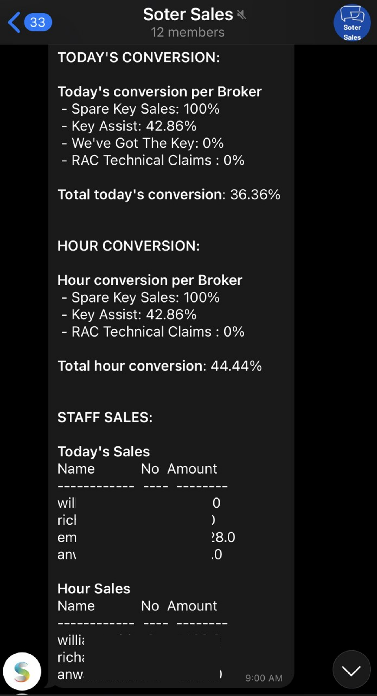

# Report Telegram Bot Project

The project is in charge of sending real live queries in form of a text message through Telegram API to report the daily figures of the sales department. This project is hosted in the Azure FunctionnsAPP ass HTTP trigger. The Azure environment allows this project to be serverless and only be used on-demand. This HTTP is triggered by Azure Logic APPs.

## api/FunctionReportSales/.env File

The environment variables file must be in the main folder of the project with the following name "**.env**" and contain the following variables:

* API_KEY = Unique identifier and secret token for authentication purposes in Telegram API
* SERVER = Databse server
* DATABASE = Database 'database'
* USER_NAME = Database user name
* DATABASE_PASSWORD = Database password
* MAIN_PATH = Project main path
* TEST_GROUP = Chat id of the TEST group
* SALES_GROUP = Chat id of the SALES group
* MAIN_PATH = Name of the Azure FunctionsApp Function in this case 'FunctionReportSales'

To get the chats ids you must use this link, after adding the bot as admin to the new group look inside the response JSON for the necessary chat id.
```
https://api.telegram.org/bot<API_KEY>/getUpdates
```

## api/FunctionReportSales/src code

This project uses a few custom modules to address different goals. These modules are shared between the different chat reports.

### api/FunctionReportSales/src/bot.py

This is a custom module to be imported from other code. Its function is to send messages and images to a chat id.
To get the chat id, it should be search using the above URL.

### api/FunctionReportSales/src/db.py

This is a custom module to get a DataFrame based on a SQL query.

### api/FunctionReportSales/src/utils_bot.py

This is a curtom module to adapt the format of the data (queries results) to be printed on Telegram.

### api/FunctionReportSales/queries

This folder contains all the queries necessary for the report.

# Sales report



In the image above you can see what the chat and report look like within Telegram.

## api/FunctionReportSales/sales.py
This is the main python script to generate the sales report for the group of sales.
The code uses a series of queries saved inside the '**api/FunctionReportSales/queries**' path, all these queries are '**.sql**' files and can be modified as needed.

## api/FunctionReportSales/__init__.py
Python file executed by the Azure Function. It is responsible for receibe and processing the HTTP request. 
The request has two headers: 
* Special: (to run the code any time of the day) 
* Test: (to send a message to the test Telegram group). 
In case of not receive any of the two headers, the message will be sent to the main group between 6 am - 9 pm.

## Use:

To excecute the Azure function it is necessary:
1. Sign in to Azure (https://portal.azure.com/#home).
2. Look for 'Functions App' in the search bar and click it.
3. Select the Function App (YOUR FUNCTION APP NAME).
4. Click on "Functions" in the left menu.
5. Click on the function (YOUR FUNCTION NAME).
6. Click on "Get Function Url" in the top bar. This will give you the ```<URL>```.

You can use the URL like this:
```
<URL>
```
 1. Normal use for executions between 6 am and 9 pm. The message will be sent to the sales Telegram group.

```
<URL>?special=True
```
2. For executions outside the normal time. Also for urgent executions.

```
<URL>?test=True
```
3. For testing executions. The message will be sent to the Telegram test group.

```
<URL>?special=True&test=True
```
4. For executions outside the normal time and testing purposes. The message will be sent to the Telegram test group.